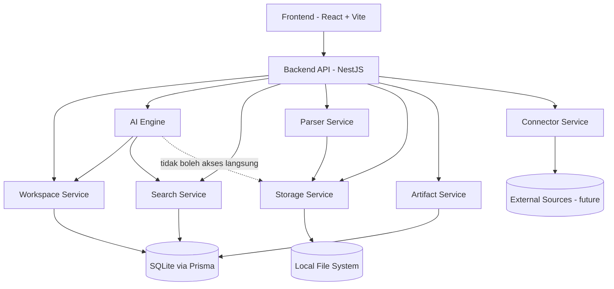

# ARCHITECTURE.md

# Arunaki System Architecture

Version: 1.1

Status: Draft

---

# 1. Design Principles

- Workspace First
- Local First
- Modular Monolith
- Separation of Concerns
- AI as a Service Layer
- Extensible Architecture
- Repository Pattern
- Provider Abstraction

---

# 2. High Level Architecture

```
Frontend (React+Vite)
    ↓
Backend API (NestJS)
    ↓
Workspace / AI / Search / Parser / Storage / Artifact
    ↓
SQLite + Prisma
    ↓
Local File Storage
```



---

# 3. Core Modules

- Frontend
- Backend API
- Workspace Service
- Parser Service
- Search Service
- AI Engine
- Storage Service
- Artifact Service
- Connector Service

## Tanggung Jawab per Modul

| Modul | Tanggung Jawab | Tidak Boleh |
|---|---|---|
| Frontend | Render UI, kirim Goal ke Backend | Menyimpan business logic AI, akses DB/Storage langsung |
| Backend API | Entry point, validasi, autentikasi, orkestrasi antar service | Menjalankan logic AI secara langsung |
| Workspace Service | Kelola Workspace, Source, Metadata, Artifact, History | Melakukan parsing file mentah |
| Parser Service | Ekstraksi teks/metadata dari PDF, DOCX, XLSX, CSV, TXT, MD | Menyimpan hasil parsing sendiri (harus lewat Storage/Workspace Service) |
| Search Service | Metadata search, FTS5, (future) vector search | Mengubah data asal |
| AI Engine | Orkestrasi Goal → Plan → Tool → Result | Mengakses Storage secara langsung |
| Storage Service | Baca/tulis file lokal | Mengetahui logic AI atau Workspace |
| Artifact Service | Kelola output yang dihasilkan AI/pengguna | Mengubah Source asli |
| Connector Service | Sinkronisasi sumber data eksternal (future) | Berjalan otomatis tanpa Workspace terkait |

---

# 4. Workspace Lifecycle

```
Create Workspace → Scan Files → Parse Documents → Extract Metadata → Index FTS → Ready for AI Chat
```

Catatan implementasi:

- Setiap tahap harus mencatat status (`pending`, `processing`, `done`, `failed`) agar Frontend bisa menampilkan progress (sesuai prinsip Transparency di Intelligence Spec).
- Jika satu file gagal di-parse, Workspace tetap boleh berstatus "Ready" dengan file tersebut ditandai `failed` — bukan memblokir seluruh Workspace.
- "Ready for AI Chat" berarti minimal: metadata ter-index dan FTS5 index terbentuk. Parsing ulang (re-index) boleh berjalan di background tanpa memblokir Chat.

---

# 5. Retrieval Architecture

Priority:

1. Metadata Search
2. SQLite FTS5
3. (Future) Vector Search

Vector Search sengaja tidak disertakan di V1, namun abstraction layer harus disiapkan.

## Retrieval Interface (disiapkan sejak V1)

Agar migrasi ke Vector Search tidak memerlukan refactor besar, Search Service harus mengakses sumber pencarian melalui satu interface, bukan memanggil FTS5 langsung dari AI Engine:

```
SearchProvider
 ├── MetadataSearchProvider   (V1 - aktif)
 ├── FtsSearchProvider        (V1 - aktif)
 └── VectorSearchProvider     (V2/Future - stub only)
```

AI Engine hanya boleh memanggil `SearchService`, tidak boleh memanggil provider secara langsung.

---

# 6. Storage Architecture

- Original files tetap berada di folder milik pengguna (tidak dipindah/diduplikasi tanpa izin).
- SQLite menyimpan metadata, bukan isi file asli.
- Artifact disimpan di folder workspace khusus, terpisah dari Source asli.
- Storage Service adalah satu-satunya modul yang boleh melakukan read/write ke file system.

---

# 7. Database Architecture

- Database: SQLite
- ORM: Prisma
- Pattern: Repository
- Future migration path: PostgreSQL tanpa mengubah business logic.

Aturan Repository Pattern:

- Business logic tidak boleh memanggil Prisma Client secara langsung; harus melalui Repository interface per modul (mis. `WorkspaceRepository`, `ArtifactRepository`).
- Ini memastikan migrasi SQLite → PostgreSQL (Section 15) hanya mengganti implementasi Repository, bukan logic di Service layer.

---

# 8. Technology Stack

**Frontend:**
- React
- Vite
- TypeScript
- Tailwind CSS
- shadcn/ui
- React Router
- TanStack Query

**Backend:**
- NestJS
- TypeScript

**Database:**
- SQLite
- Prisma ORM

**Search:**
- SQLite FTS5

**Storage:**
- Local File System

**AI:**
- OpenAI Compatible Provider
- Provider Abstraction

**Document Parsing:**
- PDF
- DOCX
- XLSX
- CSV
- TXT
- Markdown

**Logging:**
- Pino

**Testing:**
- Vitest
- Playwright

---

# 9. API Principles

*(Bagian tambahan)*

Karena Backend berbentuk Modular Monolith dengan NestJS, endpoint tetap harus mengikuti aturan berikut agar siap dipecah jadi service terpisah nanti:

- **Stateless** — tidak ada session state disimpan di memory proses; state disimpan di SQLite.
- **Versioned** — prefix `/api/v1/...` sejak awal, agar breaking change di masa depan tidak merusak client lama.
- **Modul terisolasi per NestJS Module** — `WorkspaceModule`, `SearchModule`, `AiModule`, `ParserModule`, `StorageModule`, `ArtifactModule`, `ConnectorModule` masing-masing punya boundary jelas dan hanya export apa yang perlu diakses modul lain.
- **Konsisten** — response shape yang sama untuk sukses/error di semua endpoint, misalnya `{ data, error, meta }`.

---

# 10. Security Principles (Local-First Context)

*(Bagian tambahan)*

Karena V1 bersifat Local First (bukan multi-tenant cloud), prioritas keamanan berbeda dari arsitektur cloud biasa, tapi tetap wajib ada:

- **Workspace Isolation** — satu Workspace tidak boleh membaca file/metadata Workspace lain, walau berjalan di mesin yang sama.
- **Path Traversal Protection** — Storage Service wajib memvalidasi path agar tidak bisa keluar dari folder Workspace/Source yang diizinkan.
- **Local Access Control** — jika suatu saat backend diakses lebih dari satu proses/user di satu mesin, tetap perlu autentikasi dasar (mis. token lokal), jangan asumsikan "local = aman".
- **AI Provider Key Handling** — API key untuk OpenAI-compatible provider tidak boleh dikirim ke Frontend dalam bentuk apa pun; hanya Backend yang menyimpan dan memakainya.
- **Audit Trail Minimal** — setiap aksi yang mengubah/menghapus data pengguna (Section 11) dicatat: aksi apa, kapan, oleh siapa (kalaupun user tunggal, tetap berguna untuk undo/debug).

Catatan: Multi Workspace permission dan enterprise-grade access control didorong ke roadmap Enterprise (Section 15 Future Evolution), tidak perlu di-overengineer di V1.

---

# 11. Development Rules

- Business logic tidak boleh berada di frontend.
- Antar service berkomunikasi melalui interface yang sudah didefinisikan, bukan pemanggilan langsung ke internal modul lain.
- AI tidak boleh mengakses storage secara langsung — harus melalui Storage Service.
- Semua teknologi masa depan harus diperkenalkan melalui abstraksi (Provider/Repository pattern), bukan hardcoded ke implementasi tertentu.
- Setiap aksi yang mengubah atau menghapus data pengguna wajib melalui approval step di level Backend API sebelum dieksekusi (selaras dengan Human in Control di Intelligence Spec).

---

# 12. AI Engine Responsibility Mapping

*(Bagian tambahan — menyambungkan ke INTELLIGENCE.md)*

| Tahap AI Engine | Referensi Intelligence Spec | Implementasi di Arunaki |
|---|---|---|
| Goal Interpreter | Goal First | Menerima Goal dari Backend API, bukan langsung dari Frontend |
| Context Resolver | Knowledge Hierarchy | Ambil Workspace Context via Workspace Service → Search Service, bukan query DB langsung |
| Planner | Planning Rules | Susun Task berdasarkan hasil Retrieval (Section 5) |
| Tool Selector | Tool Usage Rules | Pilih antara Search Service, Parser Service, Artifact Service sesuai Goal |
| Approval Gate | Approval Rules, Human in Control | Menahan aksi tulis/hapus data sampai user konfirmasi (Section 11) |
| Verifier & Reflector | Verification & Reflection Rules | Validasi hasil sebelum dikirim balik ke Backend API → Frontend |

Prinsip kunci: **AI Engine tidak pernah menyentuh Storage atau Database secara langsung** — semua akses selalu lewat Service yang sesuai. Ini konsisten dengan Development Rules (Section 11) dan mencegah AI Engine menjadi "God Object".

---

# 13. Architecture Decision Records

- **ADR-001:** SQLite untuk V1.
- **ADR-002:** Tidak ada Vector Search di V1.
- **ADR-003:** Workspace First.
- **ADR-004:** Local First.
- **ADR-005:** Modular Monolith.
- **ADR-006:** *(tambahan)* Repository Pattern wajib sejak V1 agar migrasi SQLite → PostgreSQL tidak menyentuh business logic.
- **ADR-007:** *(tambahan)* AI Engine berkomunikasi dengan modul lain hanya melalui Service interface, tidak pernah langsung ke Repository/Storage.

---

# 14. Scalability Note (V1 Context)

*(Bagian tambahan)*

V1 sengaja tidak dirancang untuk horizontal scaling karena sifatnya Local First dan single-user. Namun agar migrasi ke V2 (Section 15) tidak memerlukan rewrite besar:

- Setiap Core Module (Section 3) harus punya boundary yang jelas, seolah-olah bisa diekstrak jadi service terpisah kapan saja.
- Background job (parsing, indexing) sudah dipisah secara logic dari request-response cycle, walau di V1 masih berjalan di proses yang sama.
- Modular Monolith bukan alasan untuk membiarkan dependency antar-modul menjadi tidak jelas — anggap tiap modul seolah dipanggil lewat network, meski kenyataannya in-process call.

---

# 15. Future Evolution

**V1:**
- SQLite + FTS

**V2:**
- PostgreSQL
- Hybrid Retrieval
- Cloud Sync

**Enterprise:**
- Vector Search
- Distributed Workers
- Permissions
- Multi Workspace
- Plugin System

---

# 16. Success Criteria

*(Bagian tambahan)*

Arsitektur ini dianggap berhasil apabila:

- Modul baru dapat ditambahkan tanpa mengubah modul yang sudah ada.
- Migrasi SQLite → PostgreSQL hanya mengubah layer Repository, bukan Service/Business Logic.
- AI Engine dapat diganti provider-nya (Section 8) tanpa mengubah kode di Workspace/Search/Storage Service.
- Tidak ada kebocoran data antar Workspace, bahkan dalam skenario single-machine.
- Setiap keputusan arsitektur besar tercatat sebagai ADR baru, bukan berubah diam-diam.
