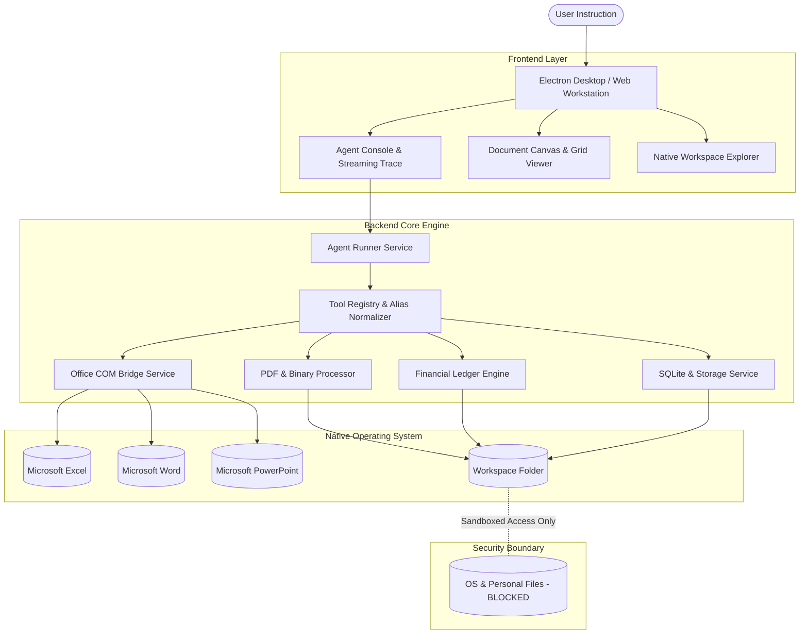

<p align="center">
  
</p>

<h1 align="center">Arunaki</h1>

<p align="center">
  <strong>The Desktop Document Agent Workstation & Automation Harness</strong><br>
  <em>A native desktop application for autonomous document editing, native Office COM execution, PDF processing pipelines, and structured workspace ledgers.</em>
</p>

<p align="center">
  
  
  
  
  
</p>

<p align="center">
  <a href="#about-arunaki">About</a> •
  <a href="#application-interface">Workstation UI</a> •
  <a href="#core-features">Core Features</a> •
  <a href="#system-architecture">Architecture</a> •
  <a href="#tool-harness-reference">Tool Reference</a> •
  <a href="#security--sandboxing">Security Model</a> •
  <a href="#getting-started">Getting Started</a> •
  <a href="#configuration">Configuration</a> •
  <a href="#testing--verification">Testing</a>
</p>

---

## About Arunaki

**Arunaki** is an integrated desktop workstation and agentic execution harness built specifically for office documents, spreadsheets, and business files.

Traditional tools require manual formula construction, line-by-line formatting, and complex scripts. Arunaki operates as an autonomous desktop agent directly within a user-selected workspace folder: reading, editing, and authoring documents across Microsoft Office (Excel, Word, PowerPoint), PDF pipelines, and tabular databases while maintaining 100% layout and formula integrity.

---

## Application Interface

Arunaki provides a unified desktop workspace divided into focused operational zones:

```
+-------------------------------------------------------------------------------+
| [Arunaki Workstation]          File  Edit  View  Terminal  Help       [-] [o] [x] |
+------------------+-----------------------------------------+------------------+
| WORKSPACE FILES  | ACTIVE DOCUMENT VIEWER / EDITOR         | AGENT CONSOLE    |
|                  |                                         |                  |
| > Financial/     | Document: Sales_Report_2026.xlsx        | > User:          |
|   - Q1_Rekap.xlsx|                                         | "Update sales"   |
|   - Budget.csv   | +---+---------------+---------------+---|                  |
| > Contracts/     | |   | A             | B             | C | * Thinking...    |
|   - Vendor_v1.docx | 1 | Category      | Revenue (IDR) | % |                  |
|   - Vendor_v2.docx | 2 | IT Services   | 45,000,000    | 60| [OK] read_file   |
| > Invoices/      | 3 | Consultation  | 30,000,000    | 40| [OK] excel_edit  |
|   - INV_001.pdf  | 4 | TOTAL         | =SUM(B2:B3)   |100|                  |
|                  | +---+---------------+---------------+---| "Updated 2 rows |
|                  |                                         |  Formula kept."  |
+------------------+-----------------------------------------+------------------+
| STATUS: Workspace Connected (C:\Workspace)                 | Engine: Online   |
+------------------------------------------------------------+------------------+
```

1. **Workspace Explorer**: Real-time folder tree with instant local file sync and native OS launch.
2. **Central Document Canvas**: Multi-format viewer and code editor supporting text, Markdown, spreadsheets, and PDF previews.
3. **Agent Conversation & Execution Stream**: Floating command console showing real-time step telemetry, tool execution badges, and progress status.

---

## Core Features

### 1. Native Office COM Automation Engine
Direct headless COM execution for Microsoft Office on Windows, guaranteeing zero layout corruption:
- **Microsoft Excel**: Cell reading, multi-cell writing, formula preservation (`=SUM(...)`, `=VLOOKUP(...)`), multi-sheet cloning, constants clearing, and direct PDF publishing.
- **Microsoft Word**: Template placeholder find-and-replace, dynamic paragraph formatting, table creation, and PDF conversion.
- **Microsoft PowerPoint**: Slide creation, structured bullet list insertion, shape text replacement, and presentation deck exporting.

### 2. Enterprise PDF & Redaction Pipeline
Comprehensive manipulation and compliance tools for binary PDF documents:
- **Page Management**: Merge multi-file documents, slice/extract page ranges, and apply custom opacity diagonal text watermarks.
- **Digital Stamping**: Coordinate-based placement of signatures, corporate seals, and digital tax stamps (e-Materai).
- **PII Data Redaction**: Automatic pattern detection and masking for sensitive personal data (national ID numbers, tax codes, bank account details, phone numbers, and email addresses).
- **Universal Format Converter**: Automated bidirectional conversion bridging Word, Excel, PowerPoint, PDF, CSV, and plain text.

### 3. Financial Reconciliation & Ledger Engine
Autonomous accounting calculations designed for minimal typing:
- **Surgical Content Patching**: Differential line replacements that preserve template structures, past transaction logs, and customer notes.
- **Multi-Bank Subtotals**: Automated balancing across payment methods (bank transfers, cash ledgers, e-commerce channels).
- **Cash & Expense Tracking**: Autonomous derivation of operating expenses, cash-in-drawer (*uang di laci*), and net variance (*selisih*).

### 4. Document Audit & Version Diffing
- Line-by-line comparison between document and contract drafts.
- Automatic generation of structured redline Markdown tables highlighting additions, modifications, and deletions.
- Quantitative variance reporting for commercial terms, pricing changes, and SLA commitments.

### 5. Structured Data & Database Management
- **Embedded SQLite Engine**: Direct structured SQL query execution and schema inspection.
- **Multi-Domain Unit Converter**: Standardized conversion across length, weight, area, volume, and multi-currency exchange rates.
- **Automated Communication Drafter**: Template generation for WhatsApp messages, invoice payment reminders, quotation summaries, and formal letters.

---

## System Architecture



---

## Tool Harness Reference

The Arunaki harness includes over 50 registered tools organized into discrete functional modules:

| Module | Primary Tools | Capabilities |
| :--- | :--- | :--- |
| **Workspace Files** | `read`, `write`, `edit`, `list`, `search_workspace`, `rename`, `delete` | Surgical diff editing, file reading, pattern search, atomic file lifecycle. |
| **Office Automation** | `desktop_excel_edit`, `desktop_word_edit`, `desktop_ppt_edit`, `desktop_open_file` | Headless COM mutations, formula preservation, template authoring, PDF export. |
| **PDF & Redaction** | `pdf_manage_pages`, `pdf_stamp_image`, `doc_redact_pii`, `convert_document` | PDF merging, page splitting, watermark stamping, e-Materai, PII masking. |
| **Document Audit** | `doc_compare_versions`, `extract_structured_data`, `document_reader` | Redline diff tables, similarity analysis, document structure parsing. |
| **Business & Data** | `data_query`, `unit_converter`, `draft_communication`, `generate_export` | SQL database queries, unit/currency conversions, communication drafts, CSV/XLSX export. |
| **Meta & Orchestration** | `todo_write`, `batch_execute`, `agent_spawn`, `ask_user` | Working memory checklist, programmatic tool calling (PTC), sub-agent delegation. |

---

## Security & Sandboxing

Arunaki is engineered with strict operational boundaries:

- 🔒 **Workspace Folder Sandboxing**: The agent is restricted entirely to the selected workspace folder. Access to operating system files, user home directories, and external drives is blocked.
- 🚫 **No Arbitrary Shell Execution**: The agent harness cannot execute arbitrary terminal commands, download unverified executables, or alter system settings.
- ⏪ **1-Click Snapshot Rollback**: Checkpoint snapshots are captured before file modifications, allowing instant one-click restoration to previous states.
- 🛡️ **Approval Gate for Destructive Actions**: Irreversible modifications require explicit user authorization prior to execution.

---

## Getting Started

### System Requirements
- **Operating System**: Windows 10/11 (64-bit) for native Office COM automation; macOS/Linux for standard document and PDF workflows.
- **Node.js**: v20.0.0 or higher
- **Package Manager**: npm v10.0.0 or higher

### Installation

```bash
# 1. Clone the repository
git clone https://github.com/JULIOSIRINGORINGO/Arunaki.git
cd Arunaki

# 2. Install dependencies across all workspaces
npm install

# 3. Initialize application database
npx prisma generate --schema=apps/api/prisma/schema.prisma
npx prisma db push --schema=apps/api/prisma/schema.prisma

# 4. Launch development environment (API Backend + Web Interface)
npm run dev
```

---

## Configuration

Application configuration is managed via environment variables in `apps/api/.env`:

| Variable | Default | Description |
| :--- | :--- | :--- |
| `PORT` | `3000` | Backend API HTTP server port. |
| `WORKSPACE_ROOT` | `./workspace` | Default path for the isolated file workspace. |
| `DATABASE_URL` | `file:./dev.db` | SQLite database connection string. |
| `ENCRYPTION_KEY` | *(Auto-generated)* | 256-bit key for securing local session credentials. |
| `DEFAULT_MODEL` | `deepseek-v4-flash:free` | Default model routed through the agent harness. |

---

## Testing & Verification

Arunaki maintains an exhaustive test suite covering unit logic, multi-batch load stress, and end-to-end live document benchmark scenarios.

```bash
# Run complete test suite (51 test suites, 252 tests)
npm test

# Run the 50-Tool batched stress and concurrency hammer test
npx vitest run apps/api/src/test-all-50-tools-batched-stress.spec.ts

# Run the live document benchmark suite (Excel, Word, PPT, PDF, Rekap)
npx vitest run apps/api/src/test-real-llm-benchmark.spec.ts
```

---

## License

Copyright © 2026 Arunaki. All rights reserved.
