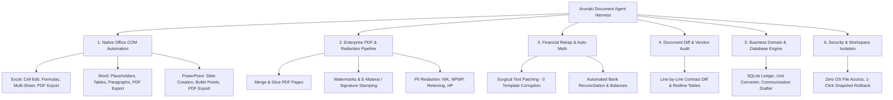

  

<h1 align="center">Arunaki</h1>

  <strong>The Desktop Document Agent & Automation Harness</strong> 
  <em>Autonomous document computer use for Excel spreadsheets, Word contracts, PowerPoint decks, PDF pipelines, and business ledgers with minimal typing.</em>

  <a href="#-what-is-arunaki">What is Arunaki?</a> •
  <a href="#-the-philosophy-minimal-typing-maximum-automation">The Philosophy</a> •
  <a href="#-primary-features--capabilities">Core Features</a> •
  <a href="#-supported-documents">Supported Formats</a> •
  <a href="#-security--workspace-isolation">Security & Boundaries</a> •
  <a href="#-download">Download</a>

---

## 🌟 What is Arunaki?

**Arunaki** is a desktop-native **Document Agent & Automation Harness** engineered specifically for business documents, spreadsheets, and office productivity.

Instead of functioning as a generic chatbot or an abstract coding terminal, Arunaki operates as an autonomous execution harness directly within your workspace folder. It handles everyday office workloads: **updating native Excel sheets via COM, authoring Word documents, formatting PowerPoint presentations, merging and watermarking PDFs, redacting sensitive personal data, and balancing financial ledgers**.

---

## ⚡ The Philosophy: Minimal Typing, Maximum Automation

You shouldn't have to spend hours formatting documents, manually editing rows, or typing complex rules. With Arunaki, you type the absolute minimum while the agent harness executes with maximum autonomy:

- 📋 **Paste Raw Messages Directly**: Copy and paste raw WhatsApp order chats, unformatted supplier notes, or messy notes into Arunaki. The harness understands the context, cleans up data, and maps entries automatically.
- 🎯 **3-Word Natural Instructions**: Type brief natural commands like `"Rekap ke excel"`, `"Update pengeluaran hari ini"`, or `"Sensor data pribadi kontrak"`. Arunaki automatically determines which file to open, which columns to fill, and which tools to invoke.
- 🧮 **Autonomous Math & Formula Preservation**: No need to write manual spreadsheet formulas. Arunaki automatically computes category breakdowns, bank transfer totals (BCA, BNI, BRI, Mandiri, Cash), expenses, cash in drawer, and updates all dependent cells in a single pass.

---

## 🚀 Primary Features & Capabilities

---

### 1. 🖥️ Native Desktop Office COM Automation
Arunaki interacts directly with Microsoft Office applications via headless COM automation, ensuring documents are modified with 100% fidelity without formatting corruption:

- **Microsoft Excel (`.xlsx`, `.xls`, `.csv`)**:
  - Writes data directly to target cells (`B2`, `S4`, `S14`).
  - Preserves existing formulas (`=SUM(...)`, `=AVERAGE(...)`) without replacing them with static numbers.
  - Supports cloning sheets, clearing constants, and exporting workbooks to PDF.
- **Microsoft Word (`.docx`, `.doc`)**:
  - Surgical placeholder replacement (e.g., `{{NAMA_KLIEN}}` $\rightarrow$ `"PT Surya Mandiri"`).
  - Appends formatted headings, styled paragraphs, and multi-column tables.
  - Exports documents directly to PDF.
- **Microsoft PowerPoint (`.pptx`, `.ppt`)**:
  - Updates text across presentation shapes.
  - Adds new structured slides with titles and bullet points.
  - Exports slide decks to PDF.

---

### 2. 📑 Enterprise PDF Processing & PII Redaction Pipeline
Comprehensive multi-stage PDF manipulation and privacy compliance:

- **Page Operations (`pdf_manage_pages`)**:
  - **Merge**: Combines multiple PDF invoices or reports into a single file.
  - **Extract**: Slices specific page ranges into standalone documents.
  - **Watermark**: Applies diagonal custom watermarks with adjustable opacity, font size, and rotation.
- **Digital Stamping (`pdf_stamp_image`)**:
  - Places digital signatures, company seals, or e-Materai stamps on exact coordinates or document anchor tags.
- **PII Data Redaction (`doc_redact_pii`)**:
  - Automatically detects and masks sensitive data formats: NIK KTP, NPWP, Bank Account Numbers, Mobile Phone Numbers, Credit Cards, and Emails.
- **Universal Document Converter (`convert_document`)**:
  - Converts files between Word, Excel, PowerPoint, PDF, CSV, and plain text formats.

---

### 3. ⚖️ Document Version Comparison & Redline Diffing (`doc_compare_versions`)
- Compares two versions of contracts, agreements, or policy documents.
- Produces a structured Markdown redline table showing added, modified, and deleted clauses.
- Calculates document similarity scores and highlights delta values (price changes, timeline extensions, SLA adjustments).

---

### 4. 🧮 Autonomous Financial Rekap & Ledger Reconciliation
- **Surgical Text Patching (`edit`)**: Modifies specific lines and totals without overwriting the original file or destroying existing layout sections (preserves past transactions, customer notes, and deposit headers).
- **Multi-Bank Subtotals**: Automatically calculates breakdowns for BCA, BNI, BRI, Mandiri, Cash, and Tokopedia/Shopee payments.
- **Balancing**: Computes total income, total expenses, cash in drawer (*uang di laci*), and net difference (*selisih*) in a single execution loop.

---

### 5. 💼 Business Domain & Structured Data Engine
- **Data Query Tool (`data_query`)**: Performs structured SQL queries on SQLite databases and inspects table schemas.
- **Unit Converter (`unit_converter`)**: Converts measurements across categories (length, mass, area, volume) and currencies (USD/EUR/IDR).
- **Communication Drafter (`draft_communication`)**: Generates pre-formatted WhatsApp payment reminders, formal emails, quotation proposals, and invoice notices.

---

### 6. 🛡️ Robust Agentic Harness & Tool Aliasing
- **Automatic Tool Alias Resolver**: Transparently maps natural tool name variations (`read_file`, `write_file`, `edit_file`, `redact`, `diff`, `merge_pdf`, `excel`, `word`) to canonical tools.
- **Parameter Normalization**: Handles flexible argument keys (`filePath` vs `path`, `find` vs `oldString`) with zero execution failure.
- **Programmatic Tool Calling (PTC)**: Executes multi-tool batches atomically in memory.

---

## 📄 Supported Documents & Formats

| Document Category | Supported Extensions | What Arunaki Automates |
| :--- | :--- | :--- |
| **Excel & Spreadsheets** | `.xlsx`, `.xls`, `.csv` | Daily sales ledgers, inventory tracking, financial reconciliations, formula preservation, PDF export. |
| **Word & Rich Text** | `.docx`, `.doc`, `.txt`, `.md` | Business contracts, formal proposals, memos, template placeholder replacement, table insertion. |
| **PowerPoint Presentations** | `.pptx`, `.ppt` | Pitch decks, monthly performance reviews, automated slide creation with bullet points. |
| **PDF Documents** | `.pdf` | Multi-document merging, page slicing, watermark stamping, e-Materai/signature placement, conversion. |
| **Databases & Structured Data** | `.db`, `.sqlite`, `.json` | SQL queries, tabular data exports, unit conversions, structured ledger audits. |

---

## 🔒 Security & Workspace Isolation

Arunaki is built with strict boundary controls to protect your data:

- **Workspace Folder Isolation**: Arunaki is restricted exclusively to the **Workspace Folder** you select. It cannot access system folders, operating system files, or external drives.
- **No Arbitrary Script Execution**: Arunaki operates only through verified document tools and native desktop Office bridges—never executing arbitrary shell commands or installing unapproved software.
- **1-Click Snapshot Rollback**: Automated backup checkpoints are captured before file mutations, allowing instant rollback to the original state.
- **Approval Gate**: Mutating actions on critical business data require user confirmation.

---

## 📥 Download

*Native Desktop App installers for Windows and macOS are currently in active preparation.*

| Platform | Package | Status |
| :--- | :--- | :--- |
| **Windows** (10 / 11 64-bit) | `.exe` / `.msi` Installer | ⏳ *In Development* |
| **macOS** (Apple Silicon / Intel) | `.dmg` Package | ⏳ *In Development* |

---

## 📄 License

Copyright © 2026 Arunaki. All rights reserved.
