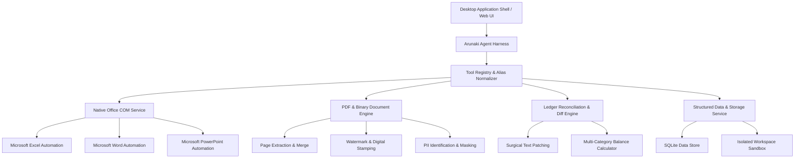

<p align="center">
  
</p>

<h1 align="center">Arunaki</h1>

<p align="center">
  <strong>Enterprise Desktop Document Agent & Automation Harness</strong><br>
  <em>Autonomous document computer use, native Office COM execution, PDF processing, and workspace ledger reconciliation.</em>
</p>

<p align="center">
  <a href="#overview">Overview</a> •
  <a href="#architecture">Architecture</a> •
  <a href="#core-capabilities">Core Capabilities</a> •
  <a href="#supported-specifications">Specifications</a> •
  <a href="#security--isolation-model">Security Model</a> •
  <a href="#getting-started">Getting Started</a> •
  <a href="#license">License</a>
</p>

---

## Overview

**Arunaki** is an autonomous desktop document agent and execution harness designed specifically for business documents, spreadsheets, and office productivity workflows.

Unlike generic conversational bots or developer-oriented script runners, Arunaki functions as an execution engine operating directly on files inside a designated workspace folder. It automates high-fidelity document tasks—such as spreadsheet calculation, template document authoring, multi-stage PDF manipulation, version reconciliation, and sensitive data redaction—with complete format preservation and zero manual formula configuration.

---

## Architecture

Arunaki is built on an isolated client-engine architecture combining a native desktop shell, an orchestration harness, and document automation services.



---

## Core Capabilities

### 1. Native Office COM Automation Engine
Direct headless COM automation for Microsoft Office formats, ensuring styling, formulas, and document layouts remain intact:

- **Spreadsheet Management (`.xlsx`, `.xls`, `.csv`)**:
  - Cell reading, range population, and dynamic calculation preservation.
  - Formula integrity retention across recalculation cycles.
  - Multi-sheet lifecycle management (sheet cloning, constant clearing, and PDF publishing).
- **Document Authoring (`.docx`, `.doc`)**:
  - Semantic placeholder replacement across header, body, and footer streams.
  - Dynamic insertion of formatted headings, bullet lists, and multi-column tables.
  - Direct PDF export with layout fidelity preservation.
- **Presentation Deck Engineering (`.pptx`, `.ppt`)**:
  - Slide generation with structured titles and hierarchical content blocks.
  - Text replacement across presentation shapes and master layouts.
  - Full deck compilation and PDF export.

---

### 2. Enterprise PDF & Redaction Pipeline
Comprehensive manipulation and compliance engine for PDF and binary assets:

- **Page-Level Orchestration (`pdf_manage_pages`)**:
  - Multi-file compilation and merge operations.
  - Selective page extraction and custom range splitting.
  - Diagonal and horizontal text watermarking with customizable rotation and opacity.
- **Document Stamping (`pdf_stamp_image`)**:
  - Automated positioning of digital signatures, corporate seals, and e-Materai stamps via coordinates or semantic anchors.
- **Privacy & PII Masking (`doc_redact_pii`)**:
  - Pattern-based detection and redaction for sensitive identifiers (national identification numbers, tax IDs, bank account numbers, phone numbers, email addresses, and payment card data).
- **Universal Format Conversion (`convert_document`)**:
  - Multi-format document conversion pipeline bridging Word, Excel, PowerPoint, PDF, CSV, and plain text.

---

### 3. Financial Reconciliation & Ledger Engine
Autonomous accounting and data processing designed for minimal human input:

- **Surgical Content Patching (`edit`)**:
  - Precise diff-based line replacements that prevent accidental template corruption or loss of historical ledger data.
- **Multi-Channel Transaction Balancing**:
  - Automatic reconciliation of payment methods (bank transfers, digital gateways, cash ledgers).
  - Autonomous calculation of operational expenses, physical cash reserves, and variance totals.
- **Unstructured Input Ingestion**:
  - Automatic parsing of unstructured text logs, transaction notes, and external records into structured ledger entries.

---

### 4. Version Audit & Redline Comparison (`doc_compare_versions`)
- Line-by-line document diffing and similarity analysis.
- Structured redline audit generation identifying additions, modifications, and deletions across legal contracts and commercial proposals.
- Quantitative variance extraction (commercial terms, timeline shifts, service-level commitments).

---

### 5. Structured Data & Domain Management
- **Database Query Engine (`data_query`)**:
  - Structured query execution and schema inspection over embedded SQLite data stores.
- **Domain Unit Converter (`unit_converter`)**:
  - Unit normalization covering length, weight, area, volume, and multi-currency exchange rates.
- **Business Communication Engine (`draft_communication`)**:
  - Automated generation of structured notices, invoice reminders, formal correspondence, and quotation summaries.

---

## Supported Specifications

| Category | Formats & Standards | Automation Scope |
| :--- | :--- | :--- |
| **Spreadsheets** | `.xlsx`, `.xls`, `.csv` | Cell-level mutations, multi-sheet workflows, formula evaluation, PDF generation. |
| **Word Processing** | `.docx`, `.doc`, `.txt`, `.md` | Template populating, table generation, typography formatting, PDF conversion. |
| **Presentations** | `.pptx`, `.ppt` | Slide compilation, shape editing, presentation exporting. |
| **Fixed Layout** | `.pdf` | Merging, splitting, watermarking, seal placement, redaction. |
| **Relational & Data** | `.db`, `.sqlite`, `.json` | SQL queries, schema audits, data export, structured transformation. |

---

## Security & Isolation Model

Arunaki is engineered around strict execution boundaries:

- **Workspace Folder Boundary**:
  - Execution is sandboxed strictly within the user-selected workspace directory.
  - Operating system files, user home directories, and external drives are completely inaccessible.
- **Restricted Tool Harness**:
  - Operations execute exclusively through authenticated document tools and Office bridges.
  - Arbitrary shell execution and unverified system calls are blocked by design.
- **Deterministic Checkpoint Rollback**:
  - Automated file snapshots are captured prior to mutations, enabling single-action state restoration.
- **Approval Gate Enforcement**:
  - High-impact data modifications require explicit user authorization prior to execution.

---

## Getting Started

### Prerequisites
- **Runtime**: Node.js 20.x or higher, npm 10.x+
- **Desktop Environment**: Windows 10/11 (64-bit) for native Office COM features; cross-platform support for standard PDF and document engines.

### Installation

```bash
# Clone the repository
git clone https://github.com/JULIOSIRINGORINGO/Arunaki.git
cd Arunaki

# Install workspace dependencies
npm install

# Start development workstation
npm run dev
```

### Verification & Test Suite

```bash
# Run unit and integration tests
npm test

# Run the 50-tool batched stress test suite
npx vitest run apps/api/src/test-all-50-tools-batched-stress.spec.ts

# Run the live document benchmark suite
npx vitest run apps/api/src/test-real-llm-benchmark.spec.ts
```

---

## License

Copyright © 2026 Arunaki. All rights reserved.
