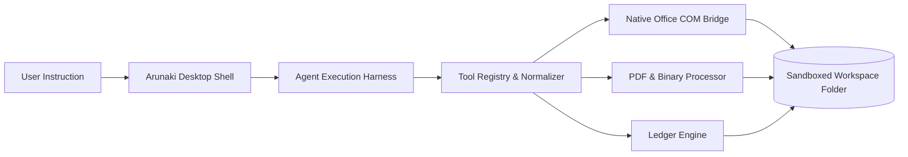

  

<h1 align="center">Arunaki Documentation</h1>

  <strong>The Desktop Document Agent Workstation & Automation Harness</strong> 
  <em>Native desktop computer-use for Microsoft Excel spreadsheets, Word contracts, PowerPoint decks, PDF pipelines, and financial ledgers.</em>

  <a href="#quick-start">Quick Start</a> •
  <a href="#core-concepts">Core Concepts</a> •
  <a href="#feature-guides">Feature Guides</a> •
  <a href="#tool-catalog">Tool Catalog</a> •
  <a href="#security--sandboxing">Security</a> •
  <a href="#configuration">Configuration</a> •
  <a href="#license">License</a>

---

## 🚀 Quick Start

### 1. Download & Install

Arunaki is distributed as a native desktop application with pre-built installers for Windows and macOS.

| Platform | Installer Package | Requirements | Status |
| :--- | :--- | :--- | :--- |
| **Windows** | `Arunaki-Setup-x64.exe` *(Setup Installer)* `Arunaki-Portable.zip` *(Standalone)* | Windows 10 / 11 (64-bit) Microsoft Office 2016+ *(for COM features)* | ✅ **Latest Release** |
| **macOS** | `Arunaki-Universal.dmg` *(Apple Silicon / Intel)* | macOS 12.0 (Monterey) or higher | ⏳ *In Development* |

1. Download the latest `Arunaki-Setup-x64.exe` installer.
2. Run the installer and follow the setup wizard.
3. Launch **Arunaki** from your Start Menu or Desktop shortcut.

### 2. Select Your Workspace Folder
When Arunaki opens, select the dedicated folder containing your business documents (e.g., `C:\Users\Admin\Documents\CompanyFiles`). 
> **Security Note**: Arunaki is sandboxed strictly to this folder. It cannot read, modify, or access any files outside your selected workspace.

### 3. Start Automating
Type short natural instructions in the chat console or paste raw text notes directly:
- *"Rekap pemasukan dan pengeluaran hari ini ke laporan_keuangan.xlsx"*
- *"Ganti nama klien di kontrak_kerjasama.docx menjadi PT Surya Mandiri"*
- *"Gabungkan semua file PDF invoice bulan ini dan beri watermark LUNAS"*

---

## 🧠 Core Concepts

### 1. The Workspace Sandbox
All document operations occur within your chosen **Workspace Folder**. The agent harness cannot execute system commands, access root operating system files, or read external drives.

### 2. Native COM vs File Modification
- **Standard Text / PDF Files**: Modified using surgical differential patching and byte-level manipulation without overwriting unreferenced template sections.
- **Microsoft Office Files (`.xlsx`, `.docx`, `.pptx`)**: Executed directly through native Windows COM automation, ensuring formulas, fonts, margins, charts, and colors remain 100% intact.

### 3. Checkpoints & 1-Click Rollback
Before applying changes to any document, Arunaki automatically creates an immutable local snapshot. If an automated modification needs to be undone, restore the original file instantly with a single click.

---

## 📖 Feature Guides

### 📊 1. Excel Spreadsheet Automation
Arunaki interacts directly with Microsoft Excel via headless COM automation:
- **Cell Population**: Reads and writes values directly to target cell coordinates (`B2`, `S4`, `S14`).
- **Formula Preservation**: Evaluates and updates dynamic formulas (`=SUM(B2:B20)`, `=VLOOKUP(...)`) without converting them into static numbers.
- **Multi-Sheet Management**: Clones monthly template sheets, clears transaction constants, and exports workbooks to PDF.

### 📝 2. Word Document Authoring
Automate corporate correspondence and legal agreements:
- **Template Placeholders**: Detects and replaces custom placeholders (e.g. `{{NAMA_KLIEN}}`, `{{TANGGAL}}`, `{{NILAI_KONTRAK}}`).
- **Structured Content**: Inserts formatted headings, styled paragraphs, and multi-column tables.
- **PDF Publishing**: Exports formatted `.docx` documents directly to PDF.

### 📑 3. PowerPoint Slide Decks
Automate presentation authoring:
- **Slide Generation**: Adds new presentation slides with structured titles and bullet points.
- **Shape Text Editing**: Updates text frames and metric callouts across existing slides.
- **Deck Export**: Compiles presentation slides to PDF for distribution.

### 🛡️ 4. Enterprise PDF & PII Redaction Pipeline
Comprehensive PDF document management:
- **Page Management (`pdf_manage_pages`)**: Merge multiple PDF invoices into a single document or extract specific page ranges.
- **Watermarking & Stamping (`pdf_stamp_image`)**: Apply custom diagonal text watermarks or position digital signatures and e-Materai stamps on exact coordinates.
- **PII Data Masking (`doc_redact_pii`)**: Detect and redact sensitive identifiers:
  - NIK KTP (Indonesian National Identity)
  - NPWP (Tax Identification Number)
  - Bank Account & Credit Card Numbers
  - Mobile Phone Numbers & Email Addresses

### ⚖️ 5. Version Audit & Redline Comparison (`doc_compare_versions`)
Compare document revisions with line-by-line diffing:
- Produces a structured Markdown redline table showing added, modified, and deleted clauses.
- Calculates document similarity scores and extracts commercial term changes (pricing, timelines, SLA terms).

---

## 🛠️ Tool Catalog

The Arunaki harness includes over 50 registered tools:

| Module | Primary Tools | Scope of Operation |
| :--- | :--- | :--- |
| **Workspace Files** | `read`, `write`, `edit`, `list`, `search_workspace`, `rename`, `delete` | File CRUD, surgical line patching, pattern search, atomic file lifecycle. |
| **Office Automation** | `desktop_excel_edit`, `desktop_word_edit`, `desktop_ppt_edit`, `desktop_open_file` | Native COM automation, formula retention, template authoring, PDF export. |
| **PDF & Compliance** | `pdf_manage_pages`, `pdf_stamp_image`, `doc_redact_pii`, `convert_document` | PDF merging, page extraction, watermark stamping, e-Materai, PII masking. |
| **Document Audit** | `doc_compare_versions`, `extract_structured_data`, `document_reader` | Redline diff tables, similarity analysis, document structure extraction. |
| **Business & Data** | `data_query`, `unit_converter`, `draft_communication`, `generate_export` | SQLite database queries, unit/currency conversion, message drafts, CSV/XLSX export. |
| **Orchestration** | `todo_write`, `batch_execute`, `agent_spawn`, `ask_user` | Working memory checklist, programmatic tool calling (PTC), sub-agent spawning. |

---

## 🔒 Security & Sandboxing

Arunaki is engineered with defense-in-depth boundaries:

- **Isolated Workspace Sandbox**: All file reads and writes are restricted exclusively to the selected workspace folder. Path traversal attempts (`../`) are intercepted and blocked.
- **Zero OS Shell Access**: The harness does not execute arbitrary terminal commands, download external scripts, or modify operating system settings.
- **Approval Gate for Destructive Actions**: Irreversible modifications require explicit user authorization before execution.
- **Automatic Local Snapshots**: Immutable backup copies are saved locally before every file mutation for instant 1-click rollback.

---

## ⚙️ Configuration

Application settings can be configured through the **Settings Panel** in the UI or via `apps/api/.env`:

| Setting | Default | Description |
| :--- | :--- | :--- |
| `PORT` | `3000` | Local API server communication port. |
| `WORKSPACE_ROOT` | `./workspace` | Default path for the isolated document workspace. |
| `DATABASE_URL` | `file:./dev.db` | Local SQLite database storage path. |
| `ENCRYPTION_KEY` | *(Auto-generated)* | 256-bit AES key for securing local session configurations. |
| `DEFAULT_MODEL` | `deepseek-v4-flash:free` | Default model routed through the agent harness. |

---

## 📄 License

Copyright © 2026 Arunaki. All rights reserved.

