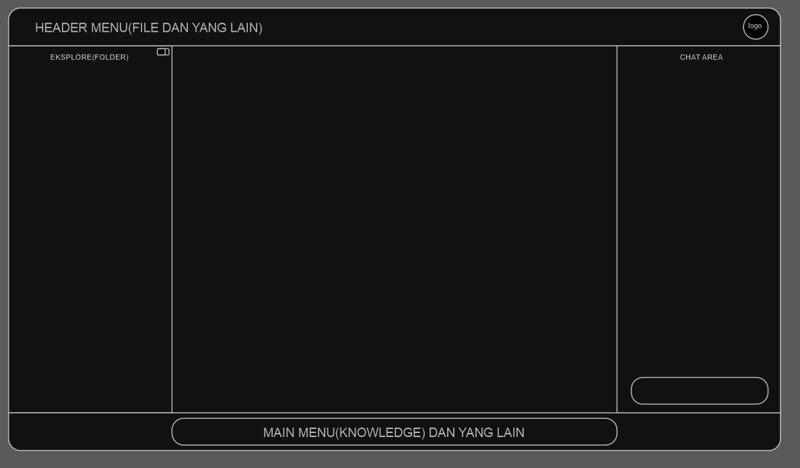

# 🦅 Arunaki

<p align="center">
  <strong>Desktop Computer Use Agent for Office & Business Documents</strong><br>
  <em>An autonomous Digital Employee that executes document workflows with minimal typing and visible desktop interaction.</em>
</p>

<p align="center">
  
</p>

<p align="center">
  <a href="#-about-arunaki">About</a> •
  <a href="#-core-philosophy-minimal-typing-maximum-automation">Philosophy</a> •
  <a href="#-workspace-sandbox-isolation">Security</a> •
  <a href="#-key-features">Features</a> •
  <a href="#-tech-stack">Tech Stack</a> •
  <a href="#-quick-start">Quick Start</a> •
  <a href="#-autonomous-benchmarks">Benchmarks</a>
</p>

---

## 🌟 About Arunaki

**Arunaki** is an autonomous Desktop AI Agent (Digital Employee) specifically engineered to automate real-world business and office document workflows. Unlike traditional coding assistants or technical script runners, Arunaki focuses on business productivity: **Spreadsheets (Excel), Word Documents, Invoices, PDFs, Financial Ledgers, and Transaction Rekapitulasi**.

Arunaki can interact visibly on your screen (launching applications, typing into Excel cells, formatting text) while strictly enforcing **Local Workspace Sandbox Isolation** to keep your host operating system safe.

---

## ⚡ Core Philosophy: Minimal Typing, Maximum Automation

Users should type as little as possible. Arunaki executes autonomously with maximum operational efficiency:

- 📋 **Raw Copy-Paste**: Paste messy WhatsApp order chats or unstructured meeting notes directly into the conversation — Arunaki parses, structures, and maps the data automatically.
- 🎯 **3-Word Instructions**: Type concise directives (e.g., `"Update daily ledger"` or `"Rekap to excel"`), and Arunaki intelligently detects the right target file, maps the correct columns, and updates all dependent calculations.
- 🧮 **Autonomous Arithmetic**: No manual formula configuration needed — Arunaki accurately computes subtotals, bank breakdowns, cash drawer balances, and updates all related cells in a single unified pass.

---

## 🛡️ Workspace Sandbox Isolation (Total Security)

Arunaki isolates all file and tool operations strictly within the user-selected **Workspace Folder**:

```
┌── HOST COMPUTER ───────────────────────────────────────────┐
│                                                            │
│  ┌── ARUNAKI (DIGITAL EMPLOYEE) ────────────────────────┐  │
│  │  Visible Desktop GUI & Headless Engines:             │  │
│  │                                                      │  │
│  │  📊 Excel — Type cells, manage formulas, format      │  │
│  │  📝 Word  — Author documents, contracts, styling     │  │
│  │  🌐 Web   — Form navigation & structured extraction  │  │
│  │  📎 File  — Read, edit, compute, automatic backup    │  │
│  │                                                      │  │
│  │  ❌ FORBIDDEN: Accessing files outside Workspace     │  │
│  │  ❌ FORBIDDEN: Arbitrary CLI / system code execution │  │
│  │  🛡️ Auto-Backup & 1-Click Rollback to .arunaki-trash/│  │
│  └──────────────────────────────────────────────────────┘  │
└────────────────────────────────────────────────────────────┘
```

---

## 🚀 Key Features

- **📊 Dual-Mode Excel Engine**:
  - **Visual COM Automation**: Interactively opens Microsoft Excel and visibly types into worksheets.
  - **Direct In-Memory XLSX Engine**: Lightning-fast headless spreadsheet manipulation (0.2s disk write) for automated background batching.
- **📝 Native Word & Document Tools**: Paragraph generation, font formatting (bold/italic), and structured document compilation.
- **⚡ Single-Pass Batching & Fast Cut-Off**: Updates dozens of spreadsheet cells and dependent ledger sums in a single round without redundant round-trips.
- **🔍 Full-Text Search (SQLite FTS5)**: Instant semantic and keyword retrieval across all session transcripts, chat turns, and audit trails.
- **🛡️ Workspace Rules Sentinel**: Real-time background sentinel that learns local business rules and updates `ARUNAKI.md` automatically.
- **🤖 Multi-Model Provider Support**: Seamlessly switch between DeepSeek V3/V4, GPT-OSS, Claude, Gemini, and local LLMs.

---

## 🏗️ Tech Stack

| Layer | Technology |
| :--- | :--- |
| **Desktop Shell & Web UI** | Electron, React 19, Vite 6, Tailwind CSS, Lucide Icons |
| **Backend Core & Engine** | NestJS 11, TypeScript, SQLite + Prisma ORM |
| **Document Processors** | XLSX, SheetJS, Windows COM Office Automation |
| **Intelligence Layer** | OpenRouter / OpenAI-Compatible Abstraction Layer |
| **Test & Benchmarks** | Vitest, Playwright, Autonomous Benchmark Runners |

---

## 📂 Project Structure

```
Arunaki/
├── apps/
│   ├── api/                # NestJS Backend (Runner, Tools, Providers, Sentinel)
│   │   ├── prisma/         # Database schema & SQLite migrations
│   │   ├── src/            # Core engine source code
│   │   └── scripts/        # Autonomous benchmark suites (Excel, Rekap, Stress-test)
│   └── web/                # React + Vite Desktop IDE Interface
│       └── src/            # Canvas Workstation, Live Chat, Telemetry UI
├── docs/                   # 📁 Architecture Specifications, PRD, & Dev Logs
│   ├── VISION.md           # Product Vision & Philosophy
│   ├── PRD.md              # Product Requirements Document
│   ├── ARCHITECTURE.md     # System Architecture & Module Boundaries
│   ├── UX_UI.md            # Interaction & UI Guidelines
│   ├── INTELLIGENCE.md     # Intelligence Rules & Behavioral Specs
│   └── dev-logs/           # Daily Development Logs
├── AGENTS.md               # AI Software Engineer Rules & Operating Protocol
├── WORKFLOW.md             # Development Roadmap & Phase Checklist
├── package.json
└── README.md
```

---

## 🚀 Quick Start

### 1. Clone Repository & Install Dependencies
```bash
git clone https://github.com/JULIOSIRINGORINGO/Arunaki.git
cd Arunaki
npm install
```

### 2. Configure Environment Variables
Copy the example environment configuration:
```bash
cp apps/api/.env.example apps/api/.env
```
Edit `apps/api/.env` and supply your AI API key:
```env
AI_API_KEY=your-api-key-here
AI_MODEL=deepseek/deepseek-chat
PORT=3000
```

### 3. Initialize Local Database
```bash
npx prisma db push --schema=apps/api/prisma/schema.prisma
```

### 4. Start Development Server
```bash
# Concurrently start the Backend API and Desktop Web UI
npm run dev
```
- **Desktop UI**: `http://localhost:5173`
- **Backend API**: `http://localhost:3000`

---

## 🧪 Autonomous Benchmarks

Verify the agent's autonomous document mutation and multi-cell spreadsheet capabilities:

```bash
# 1. Text Document Multi-Section Benchmark (.txt)
npx tsx apps/api/scripts/test-rekap-extended.ts

# 2. Excel Spreadsheet Autonomous Cell Benchmark (.xlsx)
npx tsx apps/api/scripts/test-excel-rekap.ts
```

---

## 📄 License

Copyright © 2026 Arunaki. All rights reserved.
